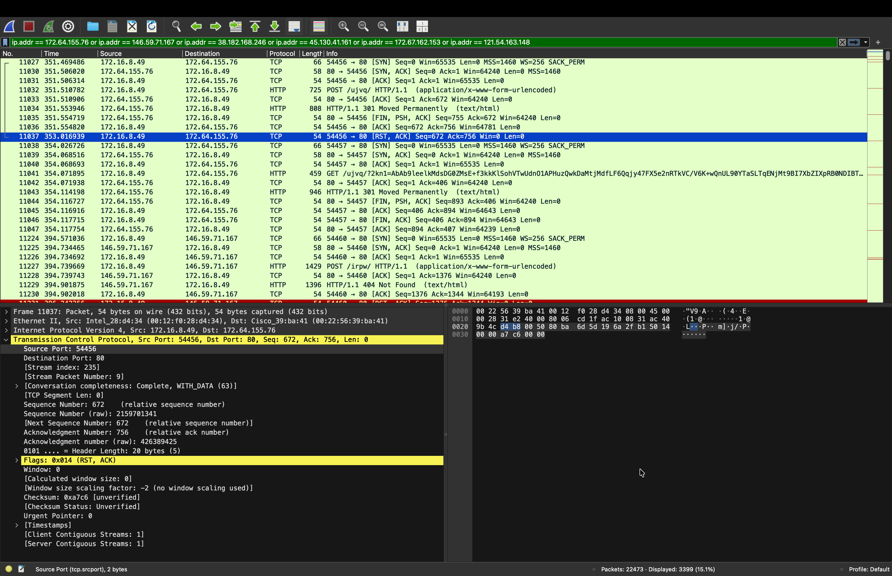
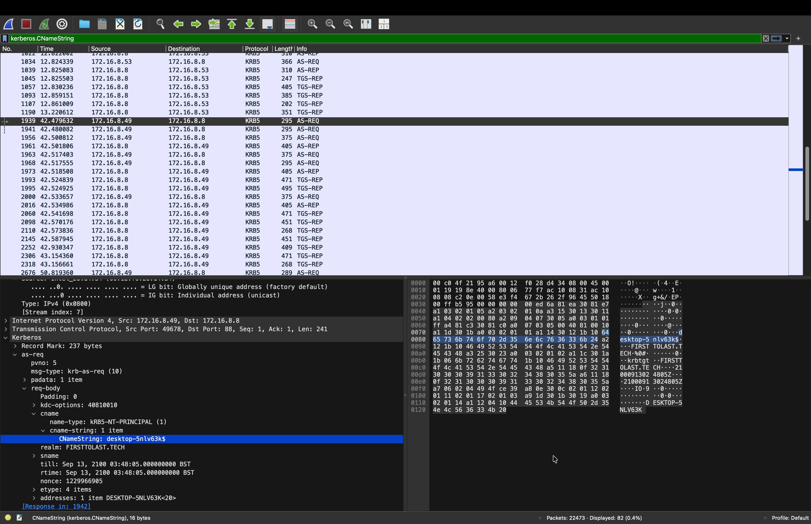
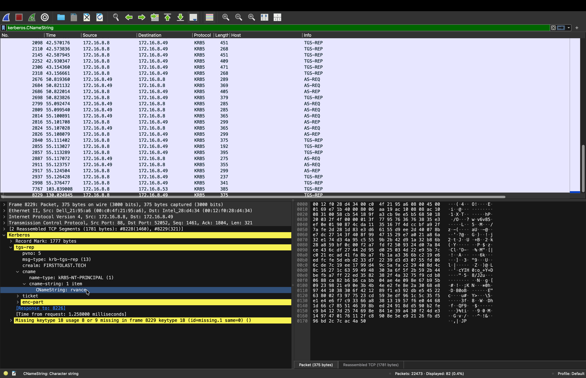
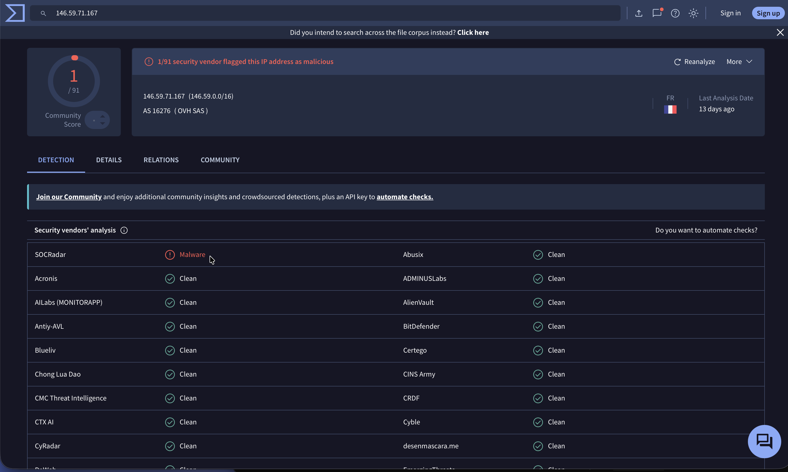
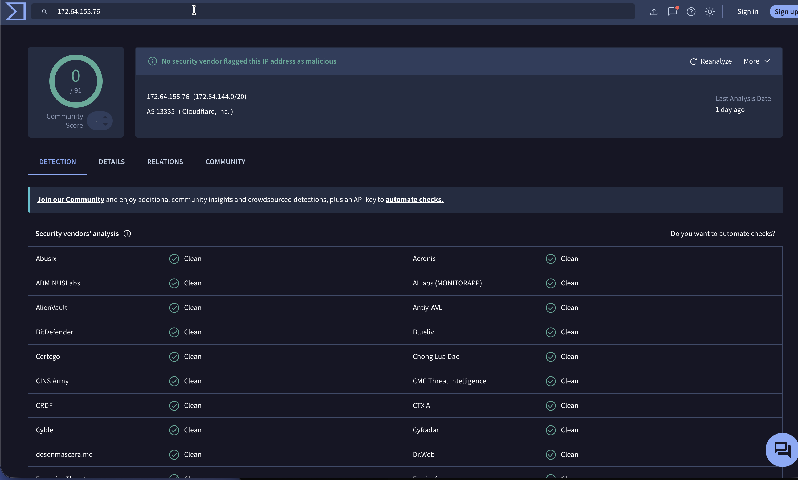
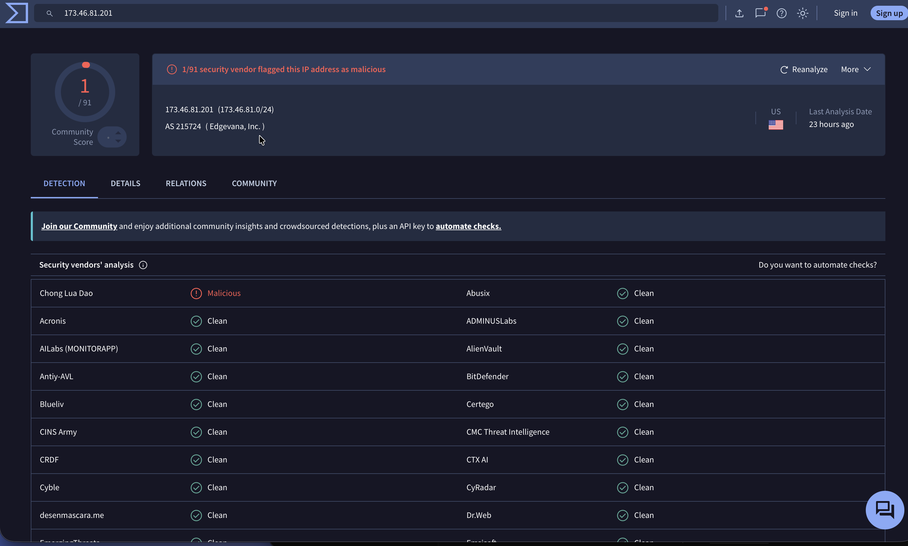

# FormBook Infection — Network Traffic Investigation

A hands-on **blue-team / SOC analysis** of a real malware infection, reconstructed from a network packet capture. I played the role of a Security Operations Center (SOC) analyst responding to intrusion-detection alerts: I confirmed the infection, identified the affected host and user, traced the command-and-control (C2) activity, verified the indicators, and mapped the attack to the MITRE ATT&CK framework.

> **Dataset:** [Malware-Traffic-Analysis.net — 2026-08-09 "First to Last"](https://www.malware-traffic-analysis.net/2026/08/09/index.html) (public training exercise).
> **Tools:** Wireshark · VirusTotal · MITRE ATT&CK
> No malware binaries or capture files are hosted in this repo only my analysis.

---

## Executive summary

Intrusion-detection alerts flagged repeated **FormBook** C2 check-ins from inside the `firsttolast.tech` network. Analysis of the packet capture confirmed a **true-positive malware infection** on a single workstation:

| Attribute | Value |
|---|---|
| Infected host (IP) | `172.16.8.49` |
| MAC address | `00:12:f0:28:d4:34` (Intel) |
| Host name | `DESKTOP-5NLV63K` |
| Windows user | `rvance` |
| Domain | `firsttolast.tech` (FIRSTTOLAST) |
| Malware | **FormBook** (information stealer / form grabber) |
| Severity | **High** |

Between **02:13 and 02:16 UTC** the host beaconed to **six external C2 servers**, uploading data via HTTP POST to short, randomised URL paths — behaviour characteristic of FormBook.

---

## Timeline of events (UTC)

| Time | Event |
|---|---|
| 02:07:32 | Capture begins. `DESKTOP-5NLV63K` (172.16.8.49) obtains its IP lease via DHCP. |
| ~02:08 | User `rvance` authenticates to the domain controller via Kerberos. |
| ~02:12 | Legitimate Windows Update / Microsoft Defender traffic (benign — see "Ruled out"). |
| 02:13 | First FormBook C2 check-in: `POST /ujvq/` to `172.64.155.76`. |
| 02:13–02:16+ | Host beacons to six C2 servers in succession (`/ujvq/`, `/irpw/`, `/lqjm/`, `/8nw8/`). |

*The infected host making repeated HTTP POST (`application/x-www-form-urlencoded`) requests to randomised paths across multiple C2 servers.*

---

## Host identification

The host name and logged-in user were recovered from Active Directory **Kerberos** traffic. The computer account ends in `$`; the user account does not.

*Kerberos `CNameString` = `desktop-5nlv63k$` (computer account), realm `FIRSTTOLAST.TECH`.*

*Kerberos `CNameString` = `rvance` (no trailing `$`) the logged-in user.*

---

## Indicators of Compromise (IOCs)

Confirmed FormBook C2 servers (by IDS signature + observed beaconing):

| C2 IP address | Hosting (ASN) | Observed URI path |
|---|---|---|
| `172.64.155.76` | Cloudflare (AS13335) | `POST /ujvq/` |
| `146.59.71.167` | OVH SAS (AS16276) | `POST /irpw/` |
| `38.182.168.246` | — | `POST /lqjm/` |
| `45.130.41.161` | — | `POST /8nw8/` |
| `172.67.162.153` | Cloudflare (AS13335) | FormBook C2 |
| `121.54.163.148` | — | FormBook C2 |

- **Malware family:** FormBook (information stealer)
- **C2 method:** HTTP POST, `application/x-www-form-urlencoded`, to short randomised paths

### Reputation analysis — and a key limitation

Each C2 address was cross-checked on VirusTotal. Notably, the scores were **low or clean**, because attackers host C2 behind trusted infrastructure (Cloudflare, OVH) and reputation databases lag behind live threats. **The definitive evidence was the IDS FormBook signature and the observed beaconing behaviour — not IP reputation.**

*`146.59.71.167` (OVH): a specialist vendor (SOCRadar) flags it as Malware, consistent with the C2 role.*

*`172.64.155.76` (Cloudflare): 0/91 detections. A clean score does **not** mean innocent — it reflects reputation lag and C2 hidden behind trusted infrastructure.*

---

## Traffic reviewed and ruled out

An executable download and several other connections were examined and determined **benign** — demonstrating the analytical step of distinguishing malicious from legitimate activity:

- `am_delta_patch_...exe` (Windows Update CDN, `173.46.81.201`) — legitimate **Microsoft Defender** signature update.
- `disallowedcertstl.cab` / `pinrulesstl.cab` (`ctldl.windowsupdate.com`) — legitimate Windows certificate-trust-list updates.
- `connecttest.txt` — standard Windows internet-connectivity checks.

*`173.46.81.201` (Windows Update CDN): effectively clean (1/91 false-positive), serving a Defender update — ruled out as benign.*

---

## MITRE ATT&CK mapping

| Tactic | Technique (ID) | Evidence in this incident |
|---|---|---|
| Command and Control | **T1071.001** — Application Layer Protocol: Web Protocols | FormBook C2 check-ins over HTTP (port 80) to six servers |
| Command and Control | **T1104** — Multi-Stage Channels | Host cycles through multiple C2 servers ("first to last") |
| Exfiltration | **T1041** — Exfiltration Over C2 Channel | Data uploaded to C2 via HTTP POST |
| Collection / Credential Access | **T1056.001** (Keylogging), **T1555** (Credentials from Password Stores) | Known FormBook capabilities, consistent with observed C2 activity |

*The last row reflects documented FormBook capabilities consistent with the traffic; keystroke/credential theft was not directly visible in the encrypted C2 payloads.*

---

## Recommendations

1. **Isolate** host `DESKTOP-5NLV63K` (172.16.8.49) to stop C2 communication and exfiltration.
2. **Reset credentials** for user `rvance` (FormBook harvests stored/typed credentials).
3. **Block** the six C2 IP addresses at the firewall / proxy.
4. **Reimage** the machine — FormBook cannot be reliably cleaned in place.
5. **Review** authentication and proxy logs for the exposure window to assess data loss.
6. **Hunt** for the same IOCs across other hosts to confirm containment.

---

## What I practised

- Reading and filtering network traffic in **Wireshark**
- Identifying a host from **DHCP** and **Kerberos** traffic
- Recognising **C2 beaconing** behaviour
- **Distinguishing malicious from benign** traffic (ruling out legitimate Windows Update)
- Understanding the **limits of reputation tools** (VirusTotal)
- Mapping activity to the **MITRE ATT&CK** framework
- Writing a professional **incident report** (see [`docs/`](docs/))

---

*Prepared as a personal skills exercise using publicly available training data. All host names, users, and addresses are from the training scenario.*
